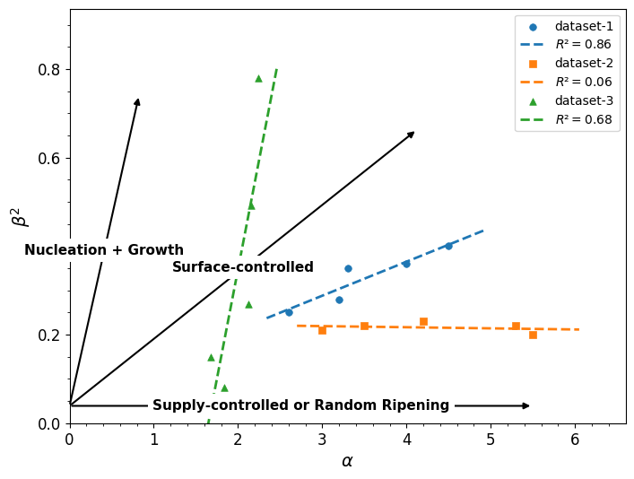

# Alpha-Beta² Plotter  
## A Modern Framework for Crystallite Size Distribution Analysis  

This project provides an open-source, user-friendly implementation of the established α-β² method for  
analyzing crystallite size distributions, originally developed by *Eberl et al. (1998)*. We hope to encourage  
with this easy-to-use framework other people to further expand the knowledge of controlling factors in crystallite growth.  

### Key Features  
- 🚀 **Modern implementation** in Python (replacing legacy software)  
- 🔍 **Intuitive workflows** for crystallite size distribution analysis of big datasets  
- 📊 **Built-in visualization** of particle size distributions and Alpha-Beta² plots  
- 📂 **CSV Format supported** for loading and exporting data  

  

---

## Table of Contents  
- [Installation](#installation)  
- [Usage](#usage)  
  - [Loading Data](#loading-data)  
  - [Plotting Data](#plotting-data)  
  - [Export Data](#export-data)  
- [License](#license)  
- [References](#references)  

---

## Installation

### Requirements

|Package        | Version   | Installation Command            |
|---------------|-----------|---------------------------------|
| Python        |  ≥3.8     | `conda install python=3.9.2`    |
| NumPy         |  1.23.x   | `pip install numpy==1.23.4`     |
| SciPy         |  1.9.x    | `pip install scipy==1.9.1`      |
| Matplotlib    |  3.6.x    | `pip install matplotlib==3.6.2` |
| Pandas        |  2.1.x    | `pip install pandas==2.1.4`     |
| Diptest       |  0.9.x    | `pip install diptest==0.9.0`    |


**For exact reproduction:**
```bash
pip install -r requirements.txt  # uses pinned versions
```


### Option 1: Clone Repository (Development Setup)
For local development or to use as a Python package in your environment:  

```bash
git clone https://github.com/sucean/alphabetasquared.git
cd alphabetasquared
pip install -e .
```

### Option 2: Install via pip (Production Use)
```bash
pip install git+https://github.com/sucean/alphabetasquared.git
```
---
## Usage

First import the package into your prefered Python environment:  

```Python
from alphabetasquared import AlphaBetaSquared
```

### Loading Data

Currently only the import of CSV files is supported.  
**Important:** Use utf-8 encoding for the CSV files!  
Each CSV file should contain a dataset of particles sizes [nm] with a Column name for each subsample like:  

| Ex-1 | Ex-2 | Ex-3 |
|------|------|------|
| 2.3  | 4.2  | 1.0  |
| 8.0  | 0.8  | 8.2  |
| ...  | ...  | ...  |

The data can be loaded during initialization of the object, either as multiple *\*args* or as a *list*.  

```Python
# using multiple *args
>>> abs = AlphaBetaSquared("data/Example-1.csv", "data/Example-2.csv", "Example-without-folder.csv")

# using a list
>>> a_list = ["data/Example-1.csv", "data/Example-2.csv", "Example-without-folder.csv"]
>>> abs = AlphaBetaSquared(list)
```
All parameter are calculated during initilization besides the size distributions for performance reasons.  

### Plotting Data
**Important** If you are using Jupyter Notebook or similar environments which automaticly display Matplotlib-Plots;  
This is temporarily surpressed in our code. If you wish that the plots are automaticly displayed use:  
```Python
>>> abs.set_auto_display(True)
```
#### Plotting Alpha-Beta²
**Quick Strat:** In the following some easy to use examples are shown to create an Alpha-Beta² Plot from your data:  
```Python
# Create a new object and load the data
>>> abs = AlphaBetaSquared("data/Example-1.csv", "data/Example-2.csv", "Example-without-folder.csv")
# Plot all available samples
>>> abs.plot_alphabeta()
>>> abs.show()  # or if you imported matplotlib.pyplot as plt you also can use plt.show()

# To plot only specific datasets:
>>> abs.plot_alphabeta("Example-1", "Example-2")
>>> abs.show()

# Additionally the figure can be scaled automaticly with:
>>> abs.set_alphabeta_scale(True)
>>> abs.plot_alphabeta()

# To automaticly save the plots:
>>> abs.set_save_plot(True)
>>> abs.plot_alphabeta()
```

**Advanced Users:** The method also returns the Pyplot Figure object if the Auto-Display is turned off (standard):  

```Python
# Return the Alpha-Beta² figure+axes and operate on it:
>>> fig, ax = abs.plot_alphabeta()
>>> ax.set_xlim(0,4)
>>> ax.set_ylim(0,0.4)
>>> for text in ax.texts:
	    text.remove()
>>> plt.show()
```

#### Plotting Particle Size Distributions:
**Quick start:** The Particle Size Distribution for the seperate samples of your dataset can also easily be plotted after loading the data.  
If the particle size distribution was not calculate beforehand, the plotting method will take care of that. Each dataset will be its own figure  
with the various samples correspondingly as subplots within this figure.  

**Note:** For the approximation of the distribution only Log-Normal Functions are currently support since these is the most common case.  

```Python
# Plot all particle size distribution of all samples and all datasets:
>>> abs.plot_distribution()
>>> abs.show()

# For saving data:
>>> abs.set_save_plot(True)
>>> abs.plot_distribution()
```

To plot specific datasets and/or samples you can use a *dict* as an argument:  
```Python
# Plot specific data:
>>> plot_dict = {
                 "Example-1" : ["Ex-1", "Ex-3"], 
	             "Example-2" : ""
				 }
>>> abs.plot_distribution(plot_dict)
>>> abs.show()
```
The *keys* of the dict have to be the names of valid datasets. If the value of the *dict* is empty (""), the size distribution  
of all samples will be plotted (Example-2). If the value is a list (Example-1) of valid samples within the corresponding dataset,  
only the particle size distribution of these samples will be plotted.  
  
  
**Advanced Users:** The method returns a list of figures, containing the figure for each dataset:  

```Python
# Return a list of figures from the method:
figures = abs.plot_distribution()

# Operate on the first figure, changing the x_label.
axes = figures[0].get_axes()
for ax in axes:
    ax.set_xlabel("Size [nm]")
abs.show()
```

### Export Data:

**Quick start:** Most of the data is calculated during initilization and can be exported as:   

```Python
# Return a list of figures from the method:
abs = AlphaBetaSquared("data/Example-1.csv", "data/Example-2.csv", "Example-without-folder.csv")
abs.export_data()


# For exporting single attributes:
abs.export_data('alpha')
```

For performance reasons the size distributions are not calculated at start.  
They have to be calculated seperatedly before beeing exported:  
```Python
# The size distribution is not calculated auotmaticly for performance reasons:
abs.calc_distribution()
abs.export_data('size_distribution')
```

## License

Copyright (c) [Year] [Your Name/Institution]  

Permission is hereby granted, free of charge, to any person obtaining a copy  
of this software and associated documentation files (the "Software"), to use,  
copy, modify, and distribute the Software **for academic purposes only**,  
subject to the following conditions:  

1. **Non-Commercial Use**:  
   The Software may not be sold, licensed, or otherwise exploited for commercial purposes.  

2. **As-Is Liability**:  
   The Software is provided "as is", without warranty of any kind. The authors  
   shall not be held liable for any damages arising from its use.  

3. **Attribution**:  
   Any academic publications using this Software must cite:  
   > [Your Publication Reference]  

4. **Redistribution**:  
   Modified versions must retain this license and disclose changes.  

**Commercial use requires separate written permission** from the copyright holders.  

## References
**Eberl, D. D., Drits, V. A., & Środoń, J.** (1998). Deducing growth mechanisms for minerals from the shapes of crystal size distributions. *American Journal of Science, 298*(6), 499–533. [https://doi.org/10.2475/ajs.298.6.499](https://doi.org/10.2475/ajs.298.6.499)

**Hartigan, J. A., & Hartigan, P. M.** (1985). The dip test of unimodality. *The annals of Statistics*, 13(1), 70-84.  [http://www.jstor.org/stable/2241144](http://www.jstor.org/stable/2241144)
